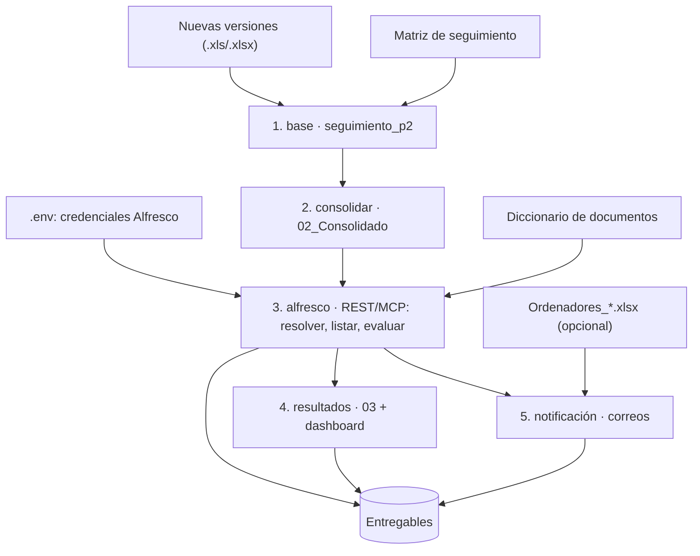

# Documentación — Sistema Automatizado de Contrataciones

Automatiza la conciliación y auditoría de contratos: toma las **nuevas versiones**
del día, las cruza con la **matriz de seguimiento**, verifica cada expediente en
**Alfresco** (API REST) y genera el informe documental y los borradores de correo.

Dos formas de ejecutarlo:
- **CLI:** `python main.py`
- **GUI:** `python -m desktop`

---

## 1. Diagrama de flujo

```
┌────────────────────────── ENTRADAS (manuales) ───────────────────────────┐
│  .env                      credenciales de Alfresco (URL, usuario, clave) │
│  nuevas versiones .xls*    archivos/01_Contratos_Descargados/             │
│  matriz de seguimiento     archivos/00_Datos_Raw/                         │
│  diccionario de documentos archivos/00_Datos_Raw/                         │
│  Ordenadores_*.xlsx        archivos/00_Datos_Raw/   (opcional)            │
└────────────────────────────────────┬─────────────────────────────────────┘
                                     ▼
      ┌──────────── FLUJO (main.py · GUI: python -m desktop) ────────────┐
      │ [1] base         seguimiento_p2 → contratos_normalizados.csv      │
      │ [2] consolidar   → 02_Consolidado_General.csv (solo nuevas ver.)  │
      │ [3] alfresco     REST/MCP: resuelve carpeta → lista archivos →    │
      │                  evalúa obligatorios del diccionario → auditoría  │
      │                  → borradores de correo                           │
      │ [4] resultados   03_Resultado_Final.xlsx + 04_Tablero_Resumen.html│
      │ [5] notificación borradores de correo a ordenadores               │
      └────────────────────────────────────┬──────────────────────────────┘
                                     ▼
┌──────── ENTREGABLES (archivos/05_Datos_filtrados/) ─────────┐
│  Auditoria_Contratos.xlsx                                    │
│  Informe_Auditoria_Contrato.html   ← informe principal       │
└──────────────────────────────────────────────────────────────┘
  (los intermedios 02/03/06/07/10 se guardan en archivos/_interno/)
```

Versión Mermaid (se ve en GitHub/visores compatibles):



> Los archivos intermedios (02, 03, 06, 07, 10) se guardan en `archivos/_interno/`.

---

## 2. Entradas

| Entrada | Ubicación | ¿Obligatoria? |
|---|---|---|
| **Nuevas versiones** (`.xlsx` o `.xls`) | `archivos/01_Contratos_Descargados/` o selección en la GUI | Sí |
| **Matriz de seguimiento** | `archivos/00_Datos_Raw/Matriz Seguimiento Contractual UIS.xlsx` | Sí |
| **Diccionario de documentos** | `archivos/00_Datos_Raw/Diccionario_Documentos.xlsx` o `Matriz_Documentos_por_Clase*.xlsx` | Sí |
| **Credenciales Alfresco** | `.env` en la raíz (copia de `.env.example`) | Sí (Alfresco real) |
| **Ordenadores** | `archivos/00_Datos_Raw/Ordenadores_*.xlsx` | No |

El `.xls` de nuevas versiones se **convierte a `.xlsx`** automáticamente al cargarlo.

---

## 3. Salidas

### Entregables al cliente (`archivos/05_Datos_filtrados/`)

| Archivo | Contenido |
|---|---|
| `Auditoria_Contratos.xlsx` | Excel con `Resumen_Cruce_Corregido` (incluye **centro de costo**, **ordenador**, valor, fecha inicio/fin, estado, docs y %), `Cruce_por_Etapa_Corr`, `DIAGNOSTICO` (una fila por contrato con contratista, valor, fechas, ordenador, **correo del ordenador**, unidad, estado, docs requeridos/hallados/faltantes, % y observación), una hoja por contrato y `Notas_Diccionario`. |
| `Informe_Auditoria_Contrato.html` | **Informe principal.** Resumen del día (contratos procesados, % con/sin carpeta, documentos hallados/faltantes), tabla general de contratos (descargable en **Excel**) y dos módulos desplegables: **contratos con carpeta** (con desplegable de documentos faltantes y cuántos lleva del total) y **contratos sin carpeta** (en rojo: "necesita carpeta"). Incluye botón **Descargar PDF**. |
| `10_Correos_Auditoria.xlsx` | Tabla `CorreosPowerAutomate` con las columnas `CORREO`, `ASUNTO` y `CUERPO`, lista para ser leída por Power Automate. |

Las credenciales de Alfresco se configuran desde la pantalla **Configuración**.
La contraseña se guarda en el Administrador de credenciales de Windows; `.env`
queda como respaldo opcional.

### Internos (`archivos/_interno/`) — no se entregan

| Archivo | Para qué |
|---|---|
| `02_Consolidado_General.csv` | Datos de trabajo del proceso |
| `06_Verificacion_Alfresco.csv` | Resultado por expediente (base del informe) |
| `07_Expedientes_Faltantes.csv` | Solo los expedientes no encontrados |
| `03_Resultado_Final.xlsx` | Tabla resumen (su información va embebida en el HTML) |
| `10_Correos_Auditoria.txt` | Borradores de correo listos para enviar a supervisores/ordenadores (plantillas `CORREOS`). Se generan por si se quieren usar, pero no son parte del informe. |

---

## 4. Módulos principales

| Módulo | Responsabilidad |
|---|---|
| `main.py` | Orquestador CLI; fases y banderas (`--backend-alfresco`, `--ruta-diccionario`, …) |
| `desktop/` | GUI PyQt6 (etapas, selección de archivos, modo demo, resultados) |
| `src/consolidar.py` | Genera el consolidado 02 solo con nuevas versiones (sin UISARD) y lo enriquece con datos del reporte financiero |
| `src/nuevas_versiones.py` | Extrae del reporte financiero: fechas, valor, contratista, unidad, estado, supervisor… |
| `src/ordenadores.py` | Carga el mapa ordenador → correo |
| `src/auditoria_documental/` | `servicio` (servicio completo), `diccionario` (carga), `match` (reglas), `workbook` (Excel), `correos` (plantillas), `informe_html` (informe visual) |
| `src/alfresco_mcp/` | `rest_gateway` (API REST), `verifier` (expediente), `motor` (orquesta), `writer` (06/07), `demo` |
| `scripts/` | Utilidades: demo, probar Alfresco, auditar un contrato, validar/generar diccionario |

### Servicio: Auditoría Documental Automatizada

Punto de entrada único: `src/auditoria_documental/servicio.py` (`ejecutar_servicio`).

> **Descripción:** Revisa automáticamente cada expediente en el repositorio documental,
> confirma qué documentos obligatorios contiene y cuáles faltan según el tipo de contrato,
> y genera el informe detallado con los borradores de notificación.

Produce los 5 entregables de la auditoría (06, 07, 09, 10 y 11). Se usa desde el flujo
(`main.py` / GUI) y desde `scripts/auditar_contrato.py` y `scripts/demo_auditoria.py`.

---

## 5. Comandos

```powershell
# GUI
python -m desktop

# Flujo completo (backend REST por defecto)
python main.py
python main.py --fecha-inicio 2026-08-01 --fecha-fin 2026-08-31

# Flujo legado con Selenium
python main.py --backend-alfresco selenium

# Utilidades
python scripts\probar_alfresco.py 0450-2026000003   # conexión + búsqueda
python scripts\auditar_contrato.py 0450-2026000003   # auditoría real de un contrato
python scripts\demo_auditoria.py                     # demo sin Alfresco
python scripts\validar_diccionario.py                # valida el diccionario
python scripts\generar_diccionario.py                # regenera el diccionario canónico

# Pruebas
python -m pytest tests -q
```

---

## 6. Reglas de negocio (auditoría)

- Solo se exigen los documentos con `OBLIGATORIEDAD = Obligatorio` del diccionario.
- La clase del contrato sale del prefijo (`0450-…` → `450`; `18` → `18 PN`/`18 PJ` según el contratista).
- Coincidencia: código de formato exacto (`FCO.55`) → alias completo → tokens del nombre.
- Equivalencias: `Seguridad Social ↔ Parafiscales`, `ARL ↔ Estándares/Constancia`.
- Regla de cierre: si existe `FCO.74` en un contrato tipo 18, `FCO.66`/`FCO.67` quedan `NO APLICA`.

Detalle completo en la hoja `REGLAS` del diccionario y en el código de
`src/auditoria_documental/match.py`.

---

## 7. Estado

- **82 pruebas automatizadas** pasando (`pytest`).
- Conexión, búsqueda, verificación y auditoría **validadas contra Alfresco real**.
- Pendiente de datos para cerrar al 100 %: `COINCIDE CON MATRIZ DE SEGUIMIENTO` y `Nº PAGOS` exactos (requieren la matriz de seguimiento).

---

## 8. Notificación a ordenadores (con autorización previa)

Módulo: `src/auditoria_documental/notificacion.py`.

1. Lee `Auditoria_Contratos.xlsx` (hoja `DIAGNOSTICO`) y toma los contratos **sin carpeta** en Alfresco.
2. Agrupa por **correo del ordenador** (`Ordenadores_*.xlsx`) y arma un correo por destinatario.
3. **No envía nada sin autorización explícita**: `enviar(..., autorizado=True)` es obligatorio. En la GUI, el botón *Preparar envío…* abre un diálogo que lista los destinatarios y exige marcar *“Autorizo el envío de estos correos”* antes de enviar.
4. El servidor SMTP se configura en `.env` (`SMTP_HOST`, `SMTP_PORT`, `SMTP_USER`, `SMTP_PASS`, `SMTP_FROM`, `SMTP_TLS`).

En la GUI: pestaña **Resultados → Notificar a ordenadores**. Muestra cuántos contratos están sin carpeta, cuántos tienen correo y a cuántos destinatarios se enviaría.
